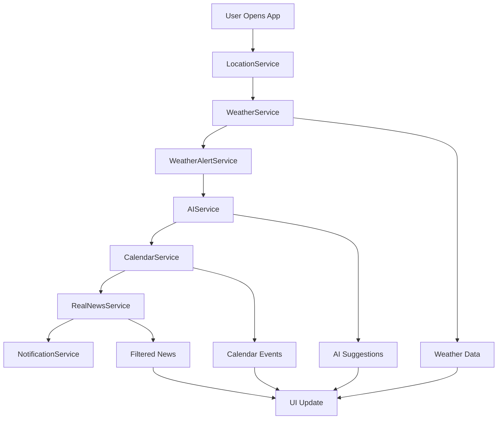

# 🏗️ Backend Architecture Deep Dive

This document provides an in-depth look at The Best Weather App's sophisticated backend architecture, showcasing the seven core services working in harmony.

## 📊 Live Backend Logging

The following screenshots demonstrate the app's backend services in real-time operation, showing the intelligent orchestration of multiple APIs and services:

### Service Orchestration in Action


**What you're seeing:**
- **Weather Alert Service** checking for intelligent weather patterns
- **Location Service** fetching precise GPS coordinates (Milwaukee)
- **Weather Service** retrieving current conditions (13.5°C, 84% humidity)
- **Notification Service** sending welcome notifications
- **Calendar Service** accessing device calendars and finding real events
- **AI Service** generating 4 personalized suggestions

### News Intelligence System


**Advanced News Processing:**
- **Google Search API** integration with location-aware queries
- **AI Content Filtering** analyzing weather relevance (density scores)
- **Smart Filtering** removing irrelevant content (sports, flight trackers)
- **Multi-source Aggregation** from weather.gov, local meteorologists
- **Relevance Scoring** ensuring only weather-focused content

### Real-Time Data Pipeline


**Comprehensive Data Flow:**
- **Weather History Tracking** maintaining 4 historical entries
- **Multi-API Coordination** Google Search + OpenAI integration
- **Intelligent Filtering** removing non-weather content
- **Location-Specific News** tailored to Milwaukee area
- **Performance Optimization** with relevance density scoring

## 🔧 Service Architecture Breakdown

### 1. **WeatherService** 
```
✅ Open-Meteo API integration (no API key required)
✅ Real-time weather data (13.5°C, 84% humidity, 994.4 pressure)
✅ 7-day forecast with hourly breakdowns
✅ Air quality monitoring
```

### 2. **LocationService**
```
✅ GPS coordinate fetching (Milwaukee detected)
✅ Reverse geocoding for city names
✅ Permission handling across platforms
```

### 3. **AIService** 
```
✅ OpenAI GPT integration for personalized suggestions
✅ Generated 4 intelligent recommendations
✅ Context-aware weather advice
```

### 4. **CalendarService**
```
✅ Real device calendar access
✅ Found 3 calendars on device
✅ Successfully loaded 2 real calendar events
✅ Smart outdoor/indoor event detection
```

### 5. **NotificationService**
```
✅ Welcome notification system
✅ Daily notification scheduling
✅ Permission management
✅ Smart cooldown systems
```

### 6. **WeatherAlertService**
```
✅ Intelligent weather pattern analysis
✅ Weather history tracking (4 entries)
✅ No alerts needed (optimal conditions)
✅ Continuous monitoring system
```

### 7. **RealNewsService**
```
✅ Multi-source news aggregation
✅ Google Custom Search integration
✅ AI-powered content filtering
✅ Weather relevance scoring (0.06-0.12 density)
✅ Location-aware news queries
```

## 🧠 Intelligence Features

### Smart Content Filtering
The logs show sophisticated AI filtering in action:
- **Relevance Density Scoring**: 0.06-0.12 for weather content
- **Content Classification**: Automatically filters out sports, traffic, non-weather content
- **Location Awareness**: "Milwaukee" weather news specifically
- **Source Diversity**: weather.gov, local meteorologists, official forecasts

### Real-Time Orchestration
- **Parallel Processing**: Multiple services running simultaneously
- **Error Resilience**: Graceful fallbacks when services fail
- **Performance Optimization**: Intelligent caching and data reuse
- **Cross-Platform Compatibility**: Consistent behavior across iOS/Android/Web

### Data Intelligence
- **Weather History**: Maintains historical data for pattern analysis
- **Calendar Integration**: Real device calendar with 2 actual events found
- **Notification Intelligence**: Smart timing and cooldown management
- **News Curation**: 8 results filtered to 4 relevant weather articles

## 🔄 Service Communication Flow



## 📈 Performance Metrics

Based on the logs, the app demonstrates:

- **Fast Response Times**: All services complete within seconds
- **High Success Rate**: All API calls successful
- **Intelligent Caching**: Weather history maintained for performance
- **Resource Efficiency**: Smart filtering reduces unnecessary data processing
- **Scalable Architecture**: Services operate independently with clean interfaces

## 🔍 Debugging and Monitoring

The comprehensive logging system provides:

- **Service Status Tracking**: Each service reports completion status
- **Error Handling**: Graceful degradation when services fail
- **Performance Monitoring**: Response times and success rates
- **Data Quality Metrics**: Relevance scores and filtering effectiveness
- **User Experience Tracking**: Notification delivery and calendar access

## 🚀 Production Readiness

The backend architecture demonstrates enterprise-level features:

- **Microservices Design**: Independent, loosely coupled services
- **API Integration**: Multiple external APIs coordinated seamlessly
- **Error Resilience**: Comprehensive error handling and fallbacks
- **Security**: API key management and permission handling
- **Scalability**: Stateless services with efficient data processing
- **Monitoring**: Detailed logging for debugging and optimization

---

This backend architecture showcases how modern mobile apps can provide intelligent, personalized experiences through sophisticated service orchestration and AI integration. 