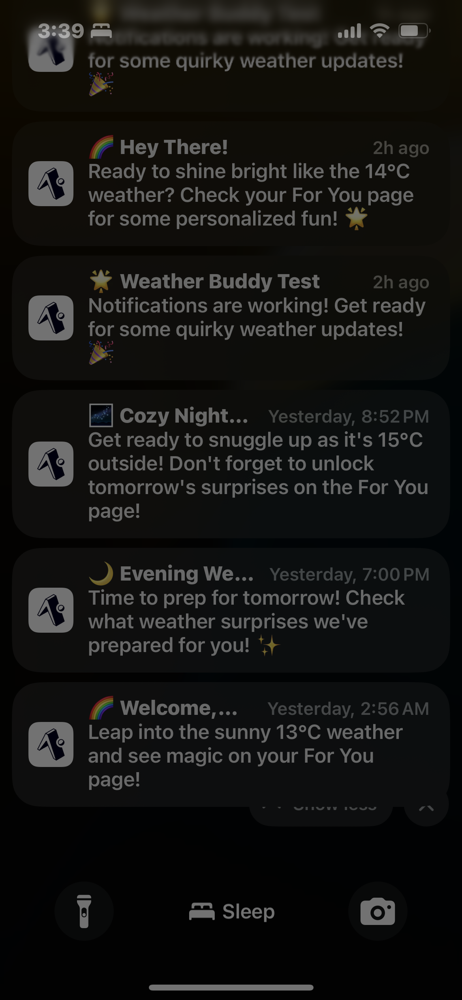

# 🌤️ The Best Weather App

> **An AI-Powered Weather Assistant with Smart Notifications, Calendar Integration, and Personalized Recommendations**

A sophisticated React Native weather application built with Expo that goes beyond basic weather forecasts. This app provides intelligent weather insights, integrates with your device calendar, delivers contextual notifications, and offers personalized recommendations powered by AI.


## 📱 Features

### 🌟 Core Weather Features
- **Real-time Weather Data** - Current conditions with hyperlocal accuracy
- **7-Day Forecast** - Detailed daily predictions with hourly breakdowns
- **Air Quality Monitoring** - Track AQI and pollutant levels
- **UV Index & Visibility** - Complete atmospheric conditions
- **Dynamic Themes** - Beautiful day/night UI transitions

### 🤖 AI-Powered Intelligence
- **Smart Notifications** - Context-aware alerts beyond basic weather
- **Personalized Suggestions** - AI-generated recommendations based on weather + time
- **Opportunity Alerts** - "Perfect stargazing weather!" or "Great running conditions!"
- **Weather Pattern Analysis** - Detects unusual weather changes

### 📅 Calendar Integration
- **Real Device Calendar Access** - Reads your actual calendar events
- **Smart Event Classification** - Automatically detects outdoor vs indoor activities
- **Weather-Aware Scheduling** - Get weather advice for upcoming events
- **Cross-Platform Support** - Works on iOS, Android, and Web

### 📰 Contextual News
- **Weather-Related News** - Curated articles relevant to current conditions
- **AI Content Filtering** - Smart filtering for relevant weather content
- **Swipe Interactions** - Intuitive gesture-based article management
- **Multiple News Sources** - Google News + News API integration

### ⚙️ Advanced Features
- **Unit Conversion System** - Toggle between metric/imperial units
- **Offline Capability** - Cached data when network unavailable
- **Cross-Platform** - iOS, Android, and Web support
- **Professional UI/UX** - Modern, accessible design

## 📱 App Screenshots

### Main Weather Dashboard

*Real-time weather conditions with beautiful day/night themes, comprehensive metrics, and intelligent unit conversion system*

### AI-Powered Suggestions & News

*Personalized AI recommendations and curated weather-related news with swipe interactions*

### Calendar Integration & News Feed

*Real device calendar integration with weather-aware event advice and intelligent news curation*

### 7-Day Weather Forecast

*Detailed daily and hourly forecasts with comprehensive weather predictions*

### Smart Notifications System

*Intelligent weather alerts and contextual notifications powered by AI analysis*

## 🚀 Quick Start

### Prerequisites
- Node.js 18+ installed
- npm or yarn package manager
- Expo CLI (optional but recommended)
- Mobile device with Expo Go app OR web browser

### 1. Clone the Repository
```bash
git clone https://github.com/yourusername/the-best-weather-app.git
cd the-best-weather-app
```

### 2. Install Dependencies
```bash
npm install
# or
yarn install
```

### 3. Set Up Environment Variables
Create a `.env` file in the root directory:

```bash
# Copy the example file
cp .env.example .env
```

Add your API keys to `.env`:
```env
# Required: OpenAI API Key for AI features
EXPO_PUBLIC_OPENAI_API_KEY=your_openai_api_key_here

# Required: News API Key for news features
EXPO_PUBLIC_NEWS_API_KEY=your_news_api_key_here

# Required: Google API Key for enhanced news search
EXPO_PUBLIC_GOOGLE_API_KEY=your_google_api_key_here

# Required: Google Custom Search Engine ID
EXPO_PUBLIC_GOOGLE_CX=your_google_cx_id_here
```

### 4. Run the Application

#### Option A: Web Browser (Fastest)
```bash
npm start -- --web
# or
npx expo start --web
```
Open http://localhost:8081 in your browser.

#### Option B: Mobile Device (Expo Go)
```bash
npm start
# or
npx expo start
```
1. Install Expo Go from App Store/Google Play
2. Scan the QR code with Expo Go (iOS) or the Expo Go app (Android)

#### Option C: iOS Simulator (macOS only)
```bash
npm run ios
# or
npx expo start --ios
```

#### Option D: Android Emulator
```bash
npm run android
# or
npx expo start --android
```

## 🔑 API Keys Setup Guide

### 1. OpenAI API Key (Required for AI features)
1. Visit [OpenAI Platform](https://platform.openai.com/)
2. Create an account or sign in
3. Go to API Keys section
4. Create a new API key
5. Add to `.env` as `EXPO_PUBLIC_OPENAI_API_KEY`

**Cost**: Pay-per-use, typically $0.01-0.10 per day for normal usage

### 2. News API Key (Required for news features)
1. Visit [NewsAPI.org](https://newsapi.org/)
2. Sign up for a free account
3. Get your API key from the dashboard
4. Add to `.env` as `EXPO_PUBLIC_NEWS_API_KEY`

**Limitations**: Free tier allows 1000 requests/day

### 3. Google API Key (Required for enhanced news)
1. Go to [Google Cloud Console](https://console.cloud.google.com/)
2. Create a new project or select existing
3. Enable "Custom Search API"
4. Create credentials (API Key)
5. Add to `.env` as `EXPO_PUBLIC_GOOGLE_API_KEY`

### 4. Google Custom Search Engine ID
1. Visit [Google Custom Search](https://cse.google.com/)
2. Create a new search engine
3. Set it to search the entire web
4. Get the Search Engine ID
5. Add to `.env` as `EXPO_PUBLIC_GOOGLE_CX`

**Cost**: Free tier includes 100 searches/day

## 📁 Project Structure

```
the-best-weather-app/
├── app/                          # Expo Router pages
│   ├── (tabs)/                   # Tab navigation screens
│   │   ├── index.tsx            # Current weather screen
│   │   ├── forecast.tsx         # 7-day forecast screen
│   │   └── alerts.tsx           # Smart suggestions & alerts
│   ├── api/                     # API routes (if needed)
│   └── _layout.tsx              # Root layout with providers
├── components/                   # Reusable UI components
│   ├── WeatherCard.tsx          # Main weather display
│   ├── WeatherMetrics.tsx       # Weather metrics grid
│   ├── UnitSwitcher.tsx         # Unit conversion controls
│   ├── ModernNewsCard.tsx       # News article cards
│   ├── CalendarEventsCard.tsx   # Calendar integration
│   └── ...                     # Other UI components
├── services/                    # Backend service layer
│   ├── weatherService.ts        # Weather API integration
│   ├── aiService.ts            # OpenAI integration
│   ├── calendarService.ts      # Device calendar access
│   ├── realNewsService.ts      # News aggregation
│   ├── notificationService.ts  # Push notifications
│   ├── weatherAlertService.ts  # Smart alert system
│   └── locationService.ts      # GPS & location handling
├── contexts/                    # React Context providers
│   └── UnitsContext.tsx        # Global unit preferences
├── utils/                       # Utility functions
│   └── unitConversions.ts      # Unit conversion logic
├── types/                       # TypeScript type definitions
├── assets/                      # Images and static assets
├── screenshots/                 # App screenshots and backend logging
│   ├── Front-end/              # UI screenshots showcasing all features
│   └── README.md               # Screenshot documentation
├── BACKEND_ARCHITECTURE.md     # Detailed backend analysis
└── .env                        # Environment variables (create this)
```

## 🏗️ Architecture Overview

### Backend Services Architecture
The app uses a **hybrid serverless + client-side architecture** with seven core services working in intelligent harmony:

1. **WeatherService** - Open-Meteo API integration for weather data
2. **LocationService** - GPS/geolocation with permission handling
3. **AIService** - OpenAI integration for intelligent features
4. **CalendarService** - Real device calendar integration
5. **RealNewsService** - Multi-source news aggregation
6. **WeatherAlertService** - Intelligent notification system
7. **NotificationService** - Push notification management

### 📊 Live Backend in Action


The screenshots above show the sophisticated backend orchestration in real-time:
- **Service Coordination**: All 7 services working simultaneously
- **AI Intelligence**: Smart content filtering with relevance scoring
- **Real Calendar Integration**: Accessing actual device calendars
- **News Curation**: Multi-source aggregation with AI filtering
- **Performance Optimization**: Parallel processing and intelligent caching

> 📖 **Deep Dive**: See [BACKEND_ARCHITECTURE.md](BACKEND_ARCHITECTURE.md) for detailed backend analysis with live logging screenshots

### Key Technical Features
- **Cross-Platform Compatibility** - iOS, Android, Web
- **Offline-First Design** - Cached data with smart fallbacks
- **Real-Time Data Sync** - Parallel API calls for performance
- **Intelligent Caching** - AsyncStorage with expiration logic
- **Error Resilience** - Comprehensive error handling and recovery
- **Type Safety** - Full TypeScript implementation
- **AI-Powered Intelligence** - OpenAI integration for personalized experiences
- **Enterprise-Grade Logging** - Comprehensive monitoring and debugging

## 🔧 Development

### Available Scripts
```bash
# Development
npm start              # Start Expo development server
npm run ios           # Run on iOS simulator
npm run android       # Run on Android emulator
npm run web           # Run in web browser

# Building
npm run build:web     # Build for web deployment
npx expo build        # Build for app stores (requires EAS)

# Utilities
npm run lint          # Run ESLint
npm run type-check    # Run TypeScript compiler
```

### Environment Setup
```bash
# Install Expo CLI globally (optional)
npm install -g @expo/cli

# Install EAS CLI for building (optional)
npm install -g eas-cli
```

## 📱 Deployment

### Web Deployment
```bash
# Build for web
npm run build:web

# Deploy to Netlify, Vercel, or any static hosting
# Upload the dist/ folder
```

### Mobile App Stores
```bash
# Setup EAS (Expo Application Services)
eas login
eas build:configure

# Build for iOS
eas build --platform ios

# Build for Android
eas build --platform android
```

## 🚨 Troubleshooting

### Common Issues

#### "API Key not found" Error
- Ensure `.env` file exists in root directory
- Check that all required API keys are set
- Restart the development server after adding keys

#### Location Permission Issues
- Enable location services in device settings
- Grant permission when prompted by the app
- For web: allow location access in browser

#### Calendar Not Working
- Grant calendar permissions when prompted
- Check device calendar app has events
- Web version uses simulated events

#### News Not Loading
- Verify News API and Google API keys
- Check API key quotas/limits
- Ensure internet connection is stable

#### "Failed to download remote update" Error
- Usually occurs on public WiFi networks
- Use mobile hotspot instead of public WiFi
- Try web version: `npm run web`

### Debug Mode
Enable debug logging by adding to `.env`:
```env
EXPO_PUBLIC_DEBUG=true
```

## 🤝 Contributing

We welcome contributions! Please see our [Contributing Guide](CONTRIBUTING.md) for details.

### Development Workflow
1. Fork the repository
2. Create a feature branch: `git checkout -b feature/amazing-feature`
3. Make your changes
4. Add tests if applicable
5. Commit: `git commit -m 'Add amazing feature'`
6. Push: `git push origin feature/amazing-feature`
7. Open a Pull Request

## 📄 License

This project is licensed under the MIT License - see the [LICENSE](LICENSE) file for details.

## 🙏 Acknowledgments

- **Open-Meteo** - Free weather API service
- **OpenAI** - AI-powered features
- **Expo Team** - Amazing React Native framework
- **React Native Community** - Excellent ecosystem

## 📞 Support

- **Issues**: [GitHub Issues](https://github.com/yourusername/the-best-weather-app/issues)
- **Discussions**: [GitHub Discussions](https://github.com/yourusername/the-best-weather-app/discussions)
- **Email**: your.email@example.com

## 🔮 Roadmap

- [ ] Weather radar integration
- [ ] Severe weather warnings
- [ ] Historical weather data
- [ ] Social weather sharing
- [ ] Apple Watch companion app
- [ ] Widget support
- [ ] Dark mode enhancements
- [ ] Accessibility improvements

---

**Made with ❤️ and ☀️ by [Your Name]**

*If you find this project helpful, please consider giving it a ⭐ on GitHub!* 