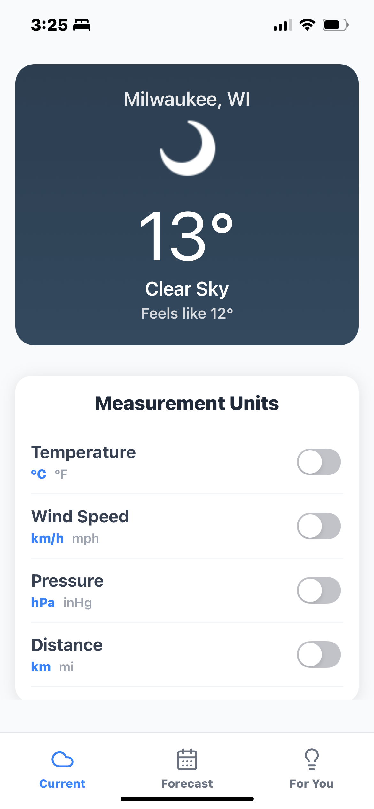
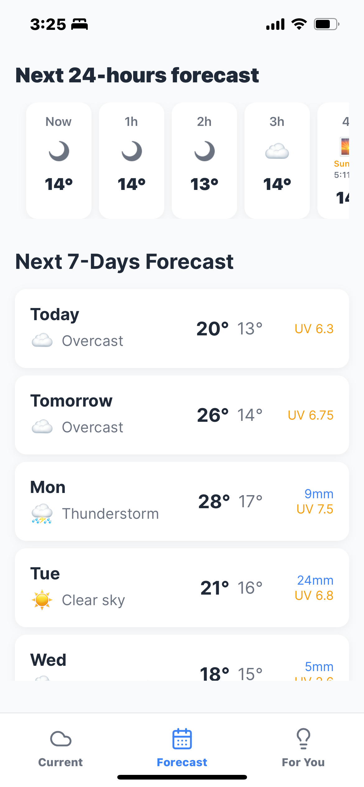
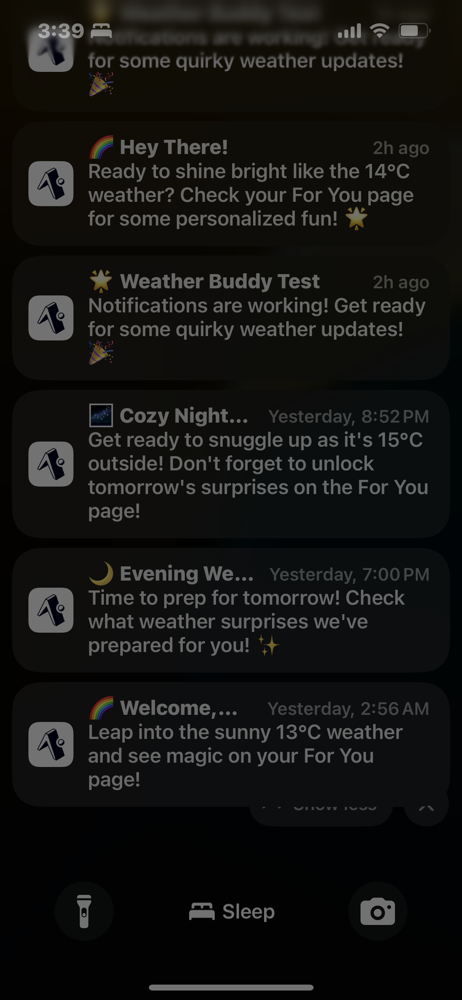

# 🚀 Complete Setup Guide for The Best Weather App

This comprehensive guide will walk you through setting up The Best Weather App from scratch. Follow these steps carefully to get the app running on your device.

## 📋 Prerequisites Checklist

Before starting, ensure you have:

- [ ] **Node.js 18+** installed ([Download here](https://nodejs.org/))
- [ ] **npm** or **yarn** package manager
- [ ] **Git** installed ([Download here](https://git-scm.com/))
- [ ] A **code editor** (VS Code recommended)
- [ ] **Mobile device** with Expo Go app OR **web browser**

### Optional (for advanced features):
- [ ] **Xcode** (macOS only, for iOS simulator)
- [ ] **Android Studio** (for Android emulator)

## 🔧 Step 1: Clone and Install

### 1.1 Clone the Repository
```bash
# Clone the repository
git clone https://github.com/Dally101/BestWeatherApp.git

# Navigate to the project directory
cd BestWeatherApp
```

### 1.2 Install Dependencies
```bash
# Install all required packages
npm install

# Or if you prefer yarn
yarn install
```

**Expected output**: You should see packages being installed. This may take 2-3 minutes.

## 🔑 Step 2: API Keys Setup

The app requires 4 API keys for full functionality. Don't worry - most are free!

### 2.1 Create Environment File
```bash
# Copy the example environment file
cp .env.example .env

# Or on Windows
copy .env.example .env
```

### 2.2 Get OpenAI API Key (Required for AI features)

1. **Visit**: [OpenAI Platform](https://platform.openai.com/)
2. **Sign up** or **sign in** to your account
3. **Navigate to**: API Keys section
4. **Click**: "Create new secret key"
5. **Copy** the key (starts with `sk-`)
6. **Add to .env**:
   ```env
   EXPO_PUBLIC_OPENAI_API_KEY=sk-your-actual-key-here
   ```

**💰 Cost**: Pay-per-use, typically $0.01-0.10 per day for normal usage

### 2.3 Get News API Key (Required for news features)

1. **Visit**: [NewsAPI.org](https://newsapi.org/)
2. **Click**: "Get API Key"
3. **Sign up** with your email
4. **Copy** your API key from the dashboard
5. **Add to .env**:
   ```env
   EXPO_PUBLIC_NEWS_API_KEY=your-news-api-key-here
   ```

**💰 Cost**: Free tier allows 1000 requests/day

### 2.4 Get Google API Key (Required for enhanced news)

1. **Visit**: [Google Cloud Console](https://console.cloud.google.com/)
2. **Create** a new project or select existing
3. **Enable** the "Custom Search API":
   - Go to "APIs & Services" > "Library"
   - Search for "Custom Search API"
   - Click "Enable"
4. **Create credentials**:
   - Go to "APIs & Services" > "Credentials"
   - Click "Create Credentials" > "API Key"
   - Copy the generated key
5. **Add to .env**:
   ```env
   EXPO_PUBLIC_GOOGLE_API_KEY=your-google-api-key-here
   ```

**💰 Cost**: Free tier includes 100 searches/day

### 2.5 Get Google Custom Search Engine ID

1. **Visit**: [Google Custom Search](https://cse.google.com/)
2. **Click**: "Add" to create a new search engine
3. **Configure**:
   - Sites to search: `*` (to search the entire web)
   - Name: "Weather News Search" (or any name)
4. **Create** the search engine
5. **Get the Search Engine ID**:
   - Click on your created search engine
   - Go to "Setup" tab
   - Copy the "Search engine ID"
6. **Add to .env**:
   ```env
   EXPO_PUBLIC_GOOGLE_CX=your-search-engine-id-here
   ```

### 2.6 Verify Your .env File

Your `.env` file should look like this:
```env
EXPO_PUBLIC_OPENAI_API_KEY=sk-proj-abc123...
EXPO_PUBLIC_NEWS_API_KEY=abc123def456...
EXPO_PUBLIC_GOOGLE_API_KEY=AIzaSyA123...
EXPO_PUBLIC_GOOGLE_CX=123abc456def...
```

## 🚀 Step 3: Run the Application

### 3.1 Start the Development Server
```bash
npm start
# or
npx expo start
```

**Expected output**: You should see a QR code and several options.

### 3.2 Choose Your Platform

#### Option A: Web Browser (Fastest for testing)
```bash
# Press 'w' in the terminal, or run:
npm run web
```
Open http://localhost:8081 in your browser.

#### Option B: Mobile Device (Recommended)
1. **Install Expo Go**:
   - iOS: [App Store](https://apps.apple.com/app/expo-go/id982107779)
   - Android: [Google Play](https://play.google.com/store/apps/details?id=host.exp.exponent)

2. **Connect to the same WiFi** as your computer

3. **Scan the QR code**:
   - iOS: Use Camera app to scan QR code
   - Android: Use Expo Go app to scan QR code

#### Option C: iOS Simulator (macOS only)
```bash
# Press 'i' in the terminal, or run:
npm run ios
```

#### Option D: Android Emulator
```bash
# Press 'a' in the terminal, or run:
npm run android
```

## ✅ Step 4: Verify Everything Works

### 4.1 Test Core Features
1. **Location Permission**: Grant location access when prompted
2. **Weather Data**: Verify current weather displays
3. **Calendar Permission**: Grant calendar access for event integration
4. **Notifications**: Allow notifications for weather alerts

### 4.2 Test AI Features
1. **Navigate to Alerts tab**
2. **Check for AI-generated suggestions**
3. **Verify news articles load**

### 4.3 Test Unit Switching
1. **Find the unit switcher** on the main screen
2. **Toggle between Celsius/Fahrenheit**
3. **Verify all temperatures update**

## 📱 What You Should See

If everything is working correctly, your app should look like these screenshots:

### Main Weather Screen

*Current weather with metrics, unit switcher, and beautiful day/night themes*

### AI Suggestions & News

*Personalized recommendations and curated weather news*

### Calendar Integration

*Real calendar events with weather-aware advice*

### Weather Forecast

*Detailed 7-day forecast with hourly breakdowns*

### Smart Notifications

*Intelligent weather alerts and contextual notifications*

## 🚨 Troubleshooting Common Issues

### Issue: "API Key not found" Error
**Solution**:
1. Ensure `.env` file exists in root directory
2. Check all API keys are properly set
3. Restart development server: `npm start`

### Issue: Location not working
**Solution**:
1. Enable location services in device settings
2. Grant permission when app requests it
3. For web: allow location access in browser

### Issue: Calendar events not showing
**Solution**:
1. Grant calendar permission when prompted
2. Ensure your device has calendar events
3. Web version shows simulated events

### Issue: News not loading
**Solution**:
1. Verify all API keys are correct
2. Check API quotas haven't been exceeded
3. Ensure stable internet connection

### Issue: "Failed to download remote update"
**Solution**:
1. Use mobile hotspot instead of public WiFi
2. Try web version: `npm run web`
3. Check firewall settings

### Issue: App crashes on startup
**Solution**:
1. Clear Expo cache: `npx expo start --clear`
2. Reinstall dependencies: `rm -rf node_modules && npm install`
3. Check Node.js version is 18+

## 🔧 Development Tips

### Hot Reloading
- Changes to code automatically refresh the app
- Shake device or press `Ctrl+M` (Android) / `Cmd+D` (iOS) for dev menu

### Debugging
- Use `console.log()` statements
- Check terminal output for errors
- Use React Native Debugger for advanced debugging

### Performance
- Use `--web` flag for faster iteration
- Use `--clear` flag if experiencing cache issues

## 📱 Building for Production

### Web Deployment
```bash
# Build for web
npm run build:web

# Deploy to Netlify, Vercel, or any static hosting
```

### Mobile App Stores
```bash
# Install EAS CLI
npm install -g eas-cli

# Login to Expo
eas login

# Configure build
eas build:configure

# Build for iOS
eas build --platform ios

# Build for Android
eas build --platform android
```

## 🎯 Next Steps

Once you have the app running:

1. **Explore Features**: Try all tabs and features
2. **Customize**: Modify colors, add features
3. **Contribute**: Submit issues or pull requests
4. **Deploy**: Share your version with others

## 📞 Need Help?

- **Issues**: [GitHub Issues](https://github.com/Dally101/BestWeatherApp/issues)
- **Documentation**: Check README.md for more details

## 🎉 Success!

If you've made it this far, congratulations! You now have a fully functional AI-powered weather app running on your device. 

**What's working:**
- ✅ Real-time weather data
- ✅ AI-powered suggestions
- ✅ Calendar integration
- ✅ Smart notifications
- ✅ News integration
- ✅ Cross-platform compatibility

Enjoy exploring your new weather app! 🌤️

---

**Made with ❤️ by Abhi Roop Reddy Tokala** 